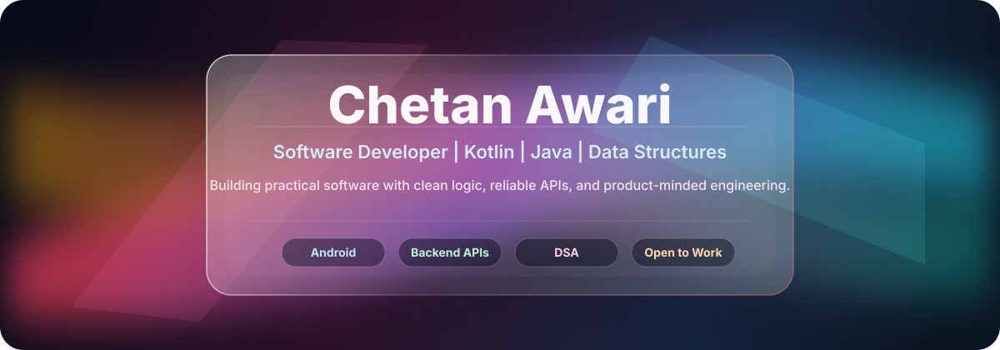
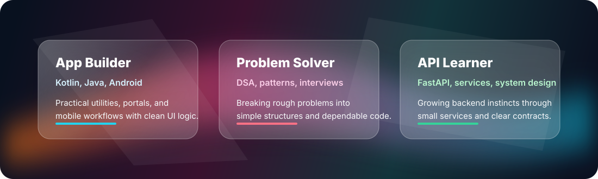

<div align="center">



[](https://git.io/typing-svg)

<a href="https://github.com/mr-chetan-66">
  
</a>
<a href="https://github.com/mr-chetan-66?tab=repositories">
  
</a>


</div>

---

## About Me

I am an enthusiastic software developer focused on Kotlin, Java, data structures, and building practical applications that solve real problems. I like turning rough ideas into working products, from Android utilities and Java portals to backend experiments and decentralized identity systems.

| Now | Strengths | Open To |
| --- | --- | --- |
| Backend APIs, Android development, system design, and production-ready Java/Kotlin engineering | Java, Kotlin, DSA, JavaScript, Python, FastAPI basics, and full-stack project structure | Software developer roles, internships, collaborations, and project reviews |

<div align="center">
  
</div>

---

## Tech Stack

<div align="center">

### Core Languages

[](https://skillicons.dev)

### Backend, Tools, and Platforms

[](https://skillicons.dev)

### Currently Leveling Up

[](https://skillicons.dev)

</div>

---

## GitHub Dashboard

<div align="center">

<picture>
  <source
    srcset="https://github-readme-stats.vercel.app/api?username=mr-chetan-66&show_icons=true&theme=radical&hide_border=true&rank_icon=github&bg_color=00000000"
    media="(prefers-color-scheme: dark)"
  />
  <source
    srcset="https://github-readme-stats.vercel.app/api?username=mr-chetan-66&show_icons=true&theme=buefy&hide_border=true&rank_icon=github&bg_color=00000000"
    media="(prefers-color-scheme: light)"
  />
  
</picture>

<picture>
  <source
    srcset="https://github-readme-streak-stats.herokuapp.com?user=mr-chetan-66&theme=radical&hide_border=true&background=00000000"
    media="(prefers-color-scheme: dark)"
  />
  <source
    srcset="https://github-readme-streak-stats.herokuapp.com?user=mr-chetan-66&theme=buefy&hide_border=true&background=00000000"
    media="(prefers-color-scheme: light)"
  />
  
</picture>

<br />

<picture>
  <source
    srcset="https://github-profile-summary-cards.vercel.app/api/cards/profile-details?username=mr-chetan-66&theme=radical"
    media="(prefers-color-scheme: dark)"
  />
  <source
    srcset="https://github-profile-summary-cards.vercel.app/api/cards/profile-details?username=mr-chetan-66&theme=vue"
    media="(prefers-color-scheme: light)"
  />
  
</picture>

<br />


</div>

---

## Featured Projects

<table>
  <tr>
    <td width="50%">
      <h3><a href="https://github.com/mr-chetan-66/DSAinJava">DSAinJava</a></h3>
      <p>Java implementations of fundamental data structures and algorithms for interview prep, coding practice, and deeper problem-solving.</p>
      <p><strong>Stack:</strong> Java, DSA</p>
    </td>
    <td width="50%">
      <h3><a href="https://github.com/mr-chetan-66/DECAID">DECAID</a></h3>
      <p>Decentralized Academic Identity and Credential Risk Assessment System.</p>
      <p><strong>Stack:</strong> JavaScript, identity systems</p>
    </td>
  </tr>
  <tr>
    <td width="50%">
      <h3><a href="https://github.com/mr-chetan-66/Automated-Medicine-Dispenser-AMDs-">Automated Medicine Dispenser</a></h3>
      <p>Smart IoT-based automated medicine dispenser built around healthcare reminders and practical device automation.</p>
      <p><strong>Stack:</strong> Kotlin, IoT, Android</p>
    </td>
    <td width="50%">
      <h3><a href="https://github.com/mr-chetan-66/HR_Employee_Mgmt_Portal">HR Employee Management Portal</a></h3>
      <p>Employee management tool developed during the Hewlett Packard Enterprise course on the Forage platform.</p>
      <p><strong>Stack:</strong> Java</p>
    </td>
  </tr>
  <tr>
    <td width="50%">
      <h3><a href="https://github.com/mr-chetan-66/FastAPI">FastAPI</a></h3>
      <p>FastAPI project and notes from Capgemini learning, focused on backend fundamentals and API development.</p>
      <p><strong>Stack:</strong> Python, FastAPI</p>
    </td>
    <td width="50%">
      <h3><a href="https://github.com/mr-chetan-66/Todo_With_WhatsApp_Integration">Todo With WhatsApp Integration</a></h3>
      <p>Todo list web application with WhatsApp integration for a more practical daily workflow.</p>
      <p><strong>Stack:</strong> JavaScript</p>
    </td>
  </tr>
</table>

---

## Repository Highlights

<div align="center">

<a href="https://github.com/mr-chetan-66/DSAinJava">
  
</a>
<a href="https://github.com/mr-chetan-66/DECAID">
  
</a>
<a href="https://github.com/mr-chetan-66/Automated-Medicine-Dispenser-AMDs-">
  
</a>
<a href="https://github.com/mr-chetan-66/HR_Employee_Mgmt_Portal">
  
</a>

</div>

---

## Latest From My GitHub

| Signal | Repository | Notes |
| --- | --- | --- |
| Latest created | [CapgCourse](https://github.com/mr-chetan-66/CapgCourse) | Course and learning repository |
| Latest updated | [DECAID](https://github.com/mr-chetan-66/DECAID) | Decentralized Academic Identity and Credential Risk Assessment System |
| Most starred | [DSAinJava](https://github.com/mr-chetan-66/DSAinJava) | Java data structures and algorithms reference |
| Public repositories | [14 repositories](https://github.com/mr-chetan-66?tab=repositories) | Java, Kotlin, Python, JavaScript, HTML, Android, and backend work |

---

## Contribution Snake

<div align="center">
  <picture>
    <source media="(prefers-color-scheme: dark)" srcset="https://raw.githubusercontent.com/mr-chetan-66/mr-chetan-66/output/github-contribution-grid-snake-dark.svg" />
    <source media="(prefers-color-scheme: light)" srcset="https://raw.githubusercontent.com/mr-chetan-66/mr-chetan-66/output/github-contribution-grid-snake.svg" />
    
  </picture>
</div>

---

## Engineering Focus

```txt
Java + Kotlin        -> production-minded app development
Data Structures      -> cleaner problem solving and interview readiness
Backend APIs         -> FastAPI and service design fundamentals
Android Projects     -> practical mobile utilities
System Design        -> scalable architecture thinking
```

<div align="center">

### Thanks for visiting.


</div>
